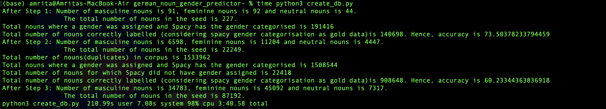

# Predict Gender of German Nouns

This project is inspired by ["Minimally supervised induction of grammatical gender"](https://dl.acm.org/doi/10.3115/1073445.1073451) - Silviu Cucerzan, David Yarowsky.
This program uses a set of steps to compute the gender of a noun using a set of rules and morphology based categorization. 

#### Files in the project
The dataset is from the [Ten Thousand German News Articles Dataset](https://tblock.github.io/10kGNAD/) also referred to as 10kGNAD,a german topic classification dataset. The topics were dropped and a consolidated file was created with just the articles. The seed list is from [200+ of the Most Common German Nouns](https://www.fluentu.com/blog/german/most-common-german-nouns/). 

| File name | What does it do ? |
| ----------- | ----------- |
| `create_db.py` | Creates the pickle objects for the corpus, seedlist and other files needed to run the program |
| `app.py` | The main file, this file is run to compute the gender for the given noun. |
| `files/nouns.txt` | the seed list of nouns |
| `files/train.txt` | the corpus in text format |
| `files/*.pkl` | pickle files needed for computing nouns |

#### How to run ?
To run the project, simply run `python3 app.py` which will take a noun as input(preferably with the first letter capitalised). The nouns is then categorised as masculine/feminine/neutral. To compare, an API request to [German Gender API](https://german-gender-api.deta.dev/) is sent which returns the accurate gender. The API may not have classified the noun in which case "tbd" is returned. In case the API hasn't encountered the noun, a message is printed. 

To check the accuracy of the rules on the corpus, run `time python3 create_db.py `. The first run can take upto 4 minutes, every successive run takes less than 30 seconds since the corpus and the associated files are stored in .pkl files. The output looks something like below:

#### Implementation Details

The program starts with a seed list of 227 nouns, masculine nouns are 91, feminine nouns are 92 and neuter nouns are 44. 
First is a rule based step where the whole corpus is scanned for nouns which are succeeded by "der", "die", "das", "dem", "des" or "den". The nouns are identified using the Spacy package. Then, based on the case of the noun and the preceeding article, a gender is assigned. The grammar rules used in this step are from [German Definite Articles](https://www.clozemaster.com/blog/german-definite-articles/). The gender assignment is then compared with the Spacy gender assignment of the noun which is taken as gold data. The accuracy of this rule-based step is 73.5%. The size of the seed is now 22,249(number of masculine nouns is 6598, feminine nouns is 11204 and neutral nouns is 4447). 

Second step is to morphology based rules to classify the nouns. Since german nouns follow a form-based morphological gender classification, we can attempt to use this to identify gender. Firstly, we create suffix arrays for every noun in the seed. The arrays are limited to suffixes of length 3 (through experimentation it was found that this gives a higher accuracy compared to using length 4). The suffixes for every noun and gender are added to a dictionary alongwith the number of occurences. Any suffix with less than 3 occurences is deleted from the dictionary. Hence, we get three dictionaries, each having suffixes for the particular gender alongwith number of occurences. It is then easy to create a probability distribution for each gender. 

Next, we loop through the text. Each noun is assigned a normalised probabibility for every gender based on its suffixes. The gender with the highest probability is picked. Again, we compare with the Spacy assigned gender of the noun. The accuracy for this step comes to 60.23%. After this step, the seed length is 87192(number of masculine nouns is 34783, feminine nouns is 45092 and neutral nouns is 7317). This does not include duplicates. 

Now we move to the prediction of gender for a new noun. We use the same method of comparing suffixes to determine the gender. To compare the predicted gender with the correct gender, an API request to [German Gender API](https://german-gender-api.deta.dev/) is sent which returns the accurate gender. The API may not have classified the noun in which case "tbd" is returned. In case the API hasn't encountered the noun, a message is printed.  

#### Future work and remarks

Adding a GUI using tkinter or PySimpleGUI to this project would be a pretty simple matter. Adding visualisation which would show the probability of each gender assignment for the noun would give further insight. 
In my opinion, this simple system performs better than the [German Gender API](https://german-gender-api.deta.dev/) in returning the gender since a lot of very common nouns have not be assigned a gender while this system is able to predict the gender. 

 